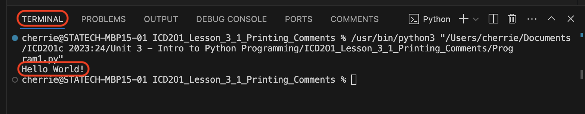

# 3.1 Printing & Comments

## Success Criteria
- [x] I can display text to the terminal/console using the print statement
- [x] I can add single line comments to my program
- [x] I can add multi-line comments to my program

## The `print` Statement
We will create our very first Python program that will display text to the screen. 
This is called **`printing`**. We do this using the `print` statement.

<ins>```EXAMPLE #1:```</ins> ```Type the code below into Lesson.py and run the program```
```python
print("Hello World!")
```
#### Let's break down what is happening:
- `print` - is the statement we use to display text to the screen
- `()` - always comes after `print` and anything you want to display to the screen **must** be inside these brackets
- `"Hello World!"` - this is the text we want to display, known as a String. Strings are always enclosed by quotes (single OR double). We will learn more about strings later.

#### You Try:
1. Type `print("Hello World!")` into the file called `Program1.py`
2. Then, click the play button in the top right corner:        


## Console/Terminal
When we run our program, it will display to the `console` or `terminal`.


## Comments
Sometimes the code we write needs some extra explanation for the person reading it. However, anything we type in the program will be read and run by Python. A solution to this is called a `Comment`. A `Comment` is text in a program that is ignored by the Python interpreter. Comments are meant for the human reading the code, and not for the computer.

#### ALWAYS WRITE COMMENTS! Why?
- Programming is often done by **teams of people** so comments will help everyone understand the code easily
- Projects you work on will be **inherited** by other people
- Comments make it easier for you to **read your own code!**

### Single Line Comments
A single line comment always starts with a `#`. When the program runs, and sees a `#`, it will ignore everything written in that line.

<ins>```EXAMPLE #2:```</ins> ```Copy and paste the following lines of comments into Lesson.py and run the program```
```python
# This is a comment. The computer will not read this line.
# print("This is a comment even though it looks like a print statement. It will not run because it starts with a #")
```

### Multi-Line Comments
Sometimes you need a longer description or explanation for your code but if you put it all in a single line comment, it will be too long and makes it difficult for the person reading it. Instead, we can use a multi-line comment by using `triple quotes` (You can use _either_ single OR double quotes - make sure to keep it consistent)

<ins>```EXAMPLE #3:```</ins> ```Copy and paste the multi-line comments into Lesson.py and run the program```
```python
'''
Anything between the triple quotes,
will not be run.
The computer will ignore
all of these lines.
'''
```